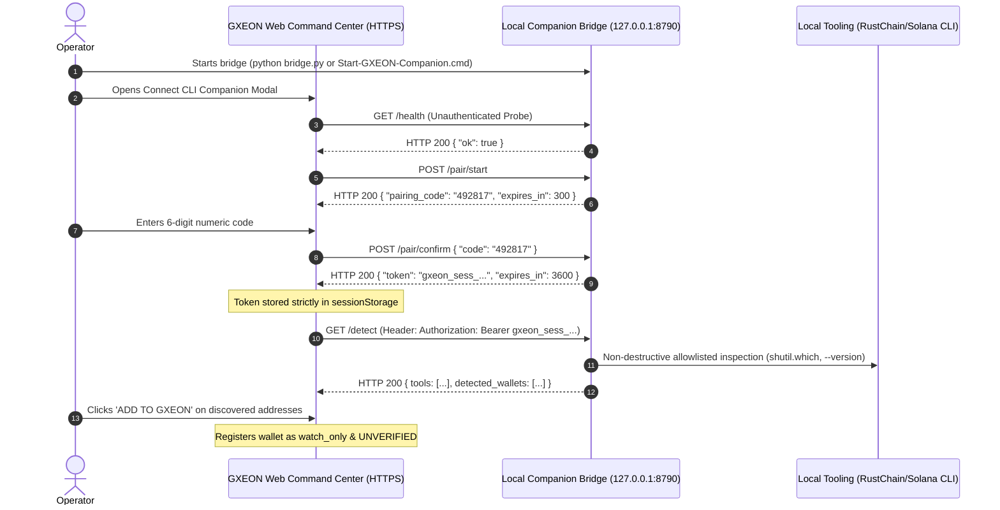

# GXEON Local Companion Pairing Protocol (V1.1)

The **GXEON Local Companion Pairing Protocol** establishes a secure, ephemeral session between the web client running on HTTPS and the local bridge daemon running on `127.0.0.1:8790`.

---

## 1. Handshake Flow

---

## 2. Pairing Rules & Invariants

1. **Numeric Code:**
   - Format: 6-digit zero-padded number (`000000`–`999999`).
   - TTL: 300 seconds (5 minutes).
   - Maximum Failed Attempts: 5 attempts before code is invalidated (HTTP 429 Too Many Requests).

2. **Session Token:**
   - Format: High-entropy cryptographic token (`secrets.token_urlsafe(32)`).
   - TTL: 3,600 seconds (1 hour).
   - In-Memory Only: Bridge stores active sessions in memory with timestamp validation; no persistent database file is created.
   - Frontend Storage: Frontend stores token exclusively in `sessionStorage`. It is wiped on tab close or session revocation.
   - Never Committed / Never Uploaded: The session token is never written to Firestore, Firebase Auth, or external logs.

3. **Session Revocation:**
   - Endpoint: `POST /pair/revoke` with Bearer token.
   - Calling this immediately removes the session token from active in-memory sessions on the bridge and clears `sessionStorage` in the browser.
